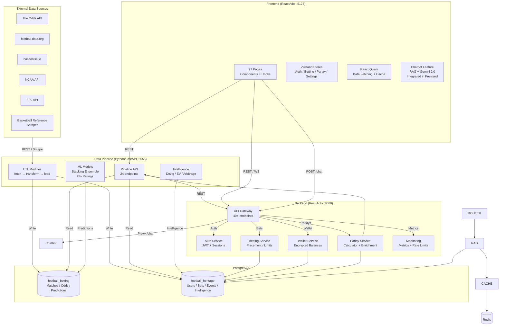
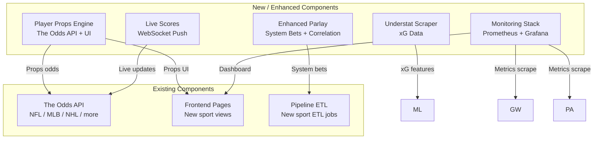

# System Architecture — FootballHeritage

## Current Architecture (Component Diagram)



## Planned Additions (Next 3 Months)



## Data Flow for New Sports (NFL / MLB / NHL)

```
1. Config: Add sport keys to ODDS_API_SPORTS env var
2. ETL: Existing fetch_raw_data.py handles any sport key generically
3. Transform: Add transform_{sport}.py (or reuse generic odds transform)
4. Load: Existing load_to_db.py handles any sport
5. Backend: Events table has sport + league columns — works generically
6. Frontend: Add sport-specific pages or expand filters in Odds page
```

## Key Integration Points
| Integration | Protocol | Data Format |
|-------------|----------|-------------|
| Pipeline → Backend | REST | JSON |
| Backend → Frontend | REST + WebSocket | JSON |
| Backend → Chatbot | REST (proxy) | JSON |
| Pipeline → DB | SQL (sqlx) | PostgreSQL |
| Chatbot → Gemini | REST | JSON (Gemini SDK) |
| Chatbot → Redis | RESP (ioredis) | String (JSON) |
